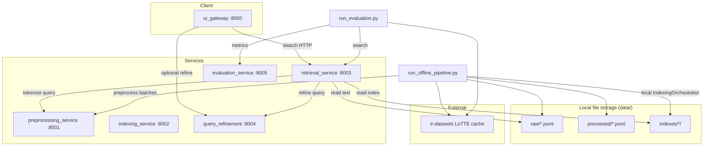

# System Architecture

Information Retrieval System — SOA + Clean Architecture (IR 2026).

## High-level diagram



## Clean Architecture layers (per service)

| Layer | Responsibility | Example |
|-------|----------------|---------|
| **API** | HTTP routes only | `*/api/routes.py` |
| **Services** | Orchestration | `retrieval_service/services/engine.py` |
| **Core** | Pure algorithms | `core/scoring.py`, `core/strategies/` |
| **Infrastructure** | Disk, HTTP clients | `infrastructure/index_repo.py` |

## Retrieval design patterns


- **Strategy pattern:** one class per model (`TFIDFStrategy`, `BM25Strategy`, …)
- **Factory pattern:** `RetrievalFactory.create(RetrievalModel)`
- **Hybrid Serial:** BM25 candidates → Sentence-BERT re-rank
- **Hybrid Parallel:** parallel scorers → Reciprocal Rank Fusion (RRF, k=60)
- **Hybrid Branching:** short → BM25, medium → TF-IDF, long → Embedding

## Embedding model

Indexing uses **Sentence-BERT** (`all-MiniLM-L6-v2`):

- Index time: encode `original_text` → `embeddings.npy`
- Query time: encode query text → cosine similarity against stored vectors

Metadata stored in `data/indexes/<dataset>/metadata.json`:

```json
{
  "embedding_type": "sentence_transformer",
  "embedding_model": "sentence-transformers/all-MiniLM-L6-v2"
}
```

## Data flow (offline pipeline)

1. Stream LoTTE documents from `ir-datasets`
2. Preprocess in batches via preprocessing_service API
3. Append to `data/raw/*.jsonl` and `data/processed/*.jsonl`
4. Build full index locally (avoids HTTP size limits)
5. Evaluation runs all qrels queries against retrieval_service

## Query refinement

- Common typo dictionary + WordNet synonym expansion
- Invoked when `use_refinement=true` on search request

## Evaluation metrics

MAP, Recall, Precision@K, nDCG@K — computed over all qrels queries (default 2076 for LoTTE lifestyle dev forum).
